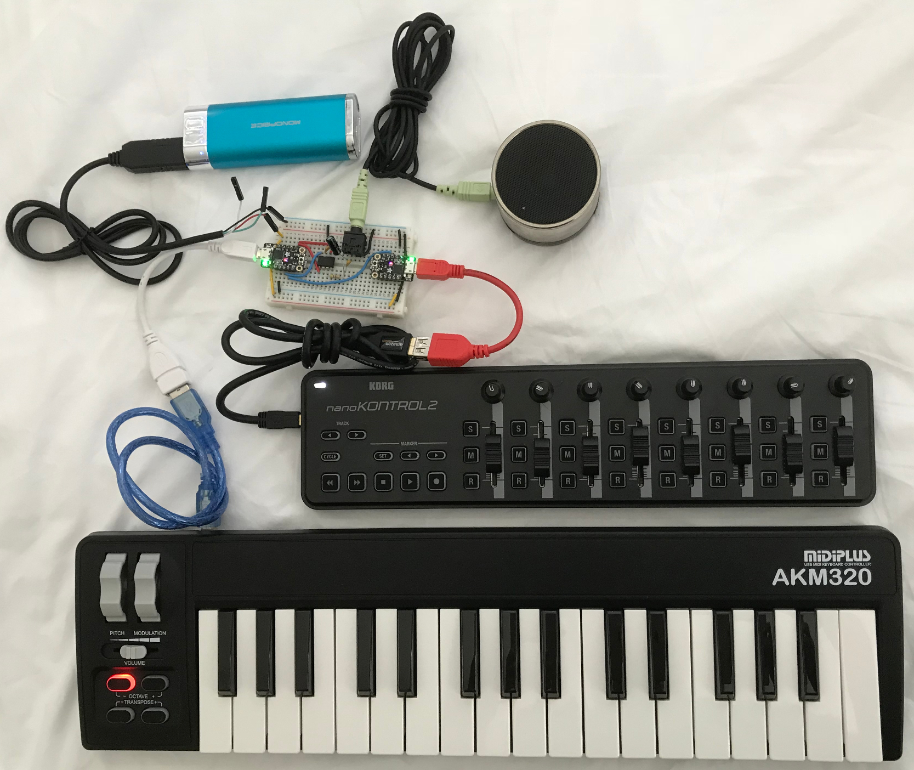

# Portable MIDI dsp-G1 Synth



Starting from the top left and going clockwise spiraling into the center, the
blue object is a 5V, 2A USB power bank. To the right is a battery powered
speaker. The dsp-G1 produces monophonic output so a single speaker is fine.
Next is a MIDI control board with 8 knobs, 8 faders, and lots of buttons. Next
is a MIDI keyboard with a volume fader (CC-07) and modulation wheel (CC-01).
The dsp-G1 ignores pitch bend so the pitch bend wheel is not useful. Next is a
breadboard with two Trinket M0s working as USB MIDI to UART MIDI converters.
The MIDI UART signals are are routed with blue wires to the MIDI input of the
dsp-G1. Yellow wires carry 5V power and red wires carry 3.3V power.

The [DSP Synthesizers
dsp-G1](https://dspsynth.eu/webshop/product/dsp-g1-analog-modeling-synthesizer/)
synth on a chip is great but building a control board with 19 knobs for 19 CCs
takes too long. I have a USB MIDI control board so connecting it would be a
quicker way to test drive the dsp-G1.

My vague idea was given a USB MIDI keyboard, a USB MIDI control board, and a
dsp-G1 synth chip, build a battery powered standalone synth. No computer so
this rules out Raspberry Pi solutions. Just plug in, power up, and start
playing.

The solution I came up with uses two Adafruit Trinket M0 boards as USB host to
UART MIDI. The Trinket M0 and the dsp-G1 all operate at 3.3V logic levels on
the same board so there is no need for DIN connectors, opto-isolators, or logic
level shifters.

The Trinket M0 is based on the Microchip SAMD21 so it is very different from
the original Trinket. The original Trinket cannot be used for this project.

## MIDI flow

```
USB MIDI Keyboard -> Trinket M0 1 UART Tx
                                   |
                                   v
USB MIDI nanoKntrl-> Trinket M0 2 UART Rx
                                  UART Tx -> dsp-G1
```

In addition, the default control board CC numbers must be mapped to the ones
required by the dsp-G1 chip. This can easily be handled in software by the
Trinket M0.

Connection table. Pins in rows are connected together.

Power   |Trinket M0 1   |Trinket M0 2   |dsp-G1
------- |-------------- |------------   |------
GND     |GND            |GND            |GND
5V      |USB            |USB            |n/c
n/c     |n/c            |3V             |VDD x 3
n/c     |TX-4           |RX-3           |n/c
n/c     |n/c            |TX-4           |MIDI RX
n/c     |n/c            |n/c            |Audio out

The 5V power source powers both Trinket M0s (TM0s) as well as the MIDI devices
connected to TM0s. The TM0-2 3.3V output powers the dsp-G1 synth chip. If a
MIDI device with lots of LEDs is used, be sure the 5V power source provides
enough current for all devices.

Both TM0s are running the same sketch. If a USB MIDI keyboard with lots of
knobs is plugged into TM0-2, TM0-1 is not needed.

Using different MIDI device will require changes to the sketch if CC numbers
must be changed.

## USB MIDI host to UART

The [USB Host Library for
SAMD](https://github.com/gdsports/USB_Host_Library_SAMD) provides the USB Host
MIDI driver. The library is derived from the [USB Host Shield
Library](https://github.com/felis/USB_Host_Shield_2.0).

The [MIDI for
Arduino](https://github.com/FortySevenEffects/arduino_midi_library) library
provides the MIDI UART driver.

## Soldered board


This picture shows the soldered proto board version. The Trinket M0s are
mounted on headers so are floating above the proto board. Unfortunately,
parallax makes it appears the Trinket M0 pins are shifted. For example, on the
left Trinket M0, the blue wires are connected to pins 3 and 4 but in the photo
they appear to connect to the 3 and Rst. Be sure to use the connection table
or zoom in on the other photo.
